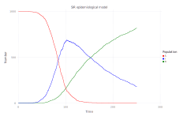

# Gillespie

[](https://travis-ci.org/sdwfrost/Gillespie.jl)

This is a preliminary implementation of [Gillespie's direct method](http://en.wikipedia.org/wiki/Gillespie_algorithm) for performing stochastic simulations. It borrows the basic interface (although none of the code) from the R library [`GillespieSSA`](http://www.jstatsoft.org/v25/i12/paper) by Mario Pineda-Krch, although `Gillespie.jl` only implements the standard exact method at present, whereas `GillespieSSA` also includes tau-leaping, *etc.*.

An example of an SIR epidemiological model:

```
using Gillespie
using Gadfly

function F(x,parms)
  (S,I,R) = x
  (beta,mu) = parms
  infection = beta*S*I
  recovery = mu*I
  [infection,recovery]
end

x0 = [999,1,0]
nu = [[-1 1 0];[0 -1 1]]
parms = [0.1/1000.0,0.01]
tf = 250.0
srand(1234)

result = ssa(x0,F,nu,parms,tf)

data = ssa_data(result)

p=plot(data,
  layer(x="time",y="x1",Geom.step,Theme(default_color=color("red"))),
  layer(x="time",y="x2",Geom.step,Theme(default_color=color("blue"))),
  layer(x="time",y="x3",Geom.step,Theme(default_color=color("green"))),
  Guide.xlabel("Time"),
  Guide.ylabel("Number"),
  Guide.manual_color_key("Population",
                            ["S", "I", "R"],
                            ["red", "blue", "green"]),
  Guide.title("SIR epidemiological model"))
```


